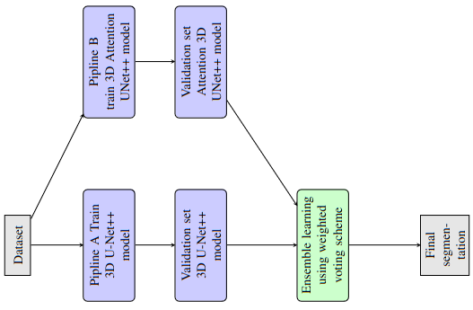
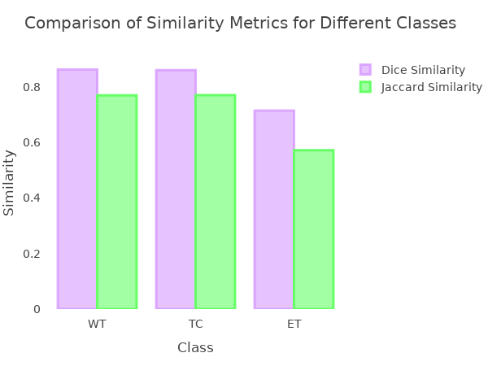
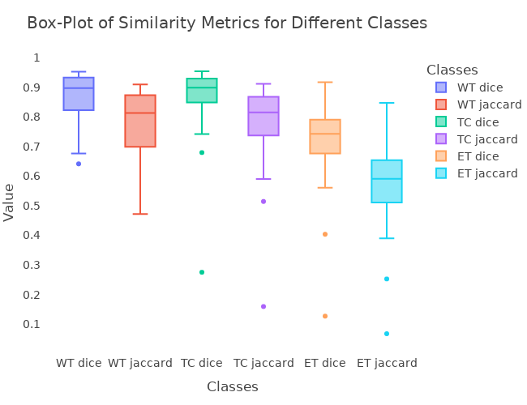

# Attention_3DUnetPP_Brain-Tumor-Segementation
this repo contain the implementaiion of paper we are working on wih the team from Jorden Univesity  of science and technology , in this work we present a new based model on Neasted 3DUnet++ combined wiht attention mechanism Block for more effiency feature extracttion 

## the problem case study in 3D Biomedical image processing

- subject
Accurate segmentation of brain tumor sub-regions is essential in the quantifica- tion of lesion burden, providing insight into the functional outcome of patients. In this regard, 3D multi-parametric magnetic resonance imaging (3D mpMRI) is widely used for non-invasive visualization and analysis of brain tumors. Different MRI sequences (such as T1, T1ce, T2, and FLAIR) are often used to provide complementary information about different brain tumor sub-regions

- Problem
in many cases for processing Medical images to get better understanding of disease and impact on human being life such Brain tumor is most area for reseachers to improve system diagnosis in partuclar Task Segementation , last few year lunch of challenge BRATS for segmentation Brain tumor Sub-regrion many of studying came up to improve CAD system ,

- Solution
For automatic segmentation we will use Unet3d To predict the age and number of days of survival: first, we will train the auto-encoder to scale the space from 4 240 240 * 150 to 512, and then extract the statistical values, ​​and hidden representations for each identifier in the data encoded by the pre-trained auto-encoder and based on this tabular data we will train SVR

1. [introduction](#introduction)
2. [environment project](#environment-project)
3. [run project](#run-project)
5. [model](#Model-Description)
5. [Results](#Results)

### introduction
*Imaging Data Description*

All BraTS multimodal scans are available as NIfTI files (.nii.gz) and describe a) native (T1) and b) post-contrast T1-weighted (T1Gd), c) T2-weighted (T2), and d) T2 Fluid Attenuated Inversion Recovery (T2-FLAIR) volumes, and were acquired with different clinical protocols and various scanners from multiple (n=19) institutions, mentioned as data contributors here.

All the imaging datasets have been segmented manually, by one to four raters, following the same annotation protocol, and their annotations were approved by experienced neuro-radiologists. Annotations comprise the GD-enhancing tumor (ET — label 4), the peritumoral edema (ED — label 2), and the necrotic and non-enhancing tumor core (NCR/NET — label 1), as described both in the BraTS 2012-2013 TMI paper and in the latest BraTS summarizing paper. The provided data are distributed after their pre-processing, i.e., co-registered to the same anatomical template, interpolated to the same resolution (1 mm^3) and skull-stripped.

### environment-project
* setup the enviroment;
	* install script shell 
       here you will need to run script shell to install all the dependencies needed for 
       run code :
       * create [kaggle](https://www.kaggle.com/) account to access to the data API 
       * add path kaggle.json to script shell $path_api
       * create the enviromenet here you will need to run 

                conda create --name Segemnetation python=3.6

       * make sure the requirements.txt exist to the repo 
       install the packges if you want fisrt neeed to run 

                pip install -r requirements.txt

       - here you will need to run script shell to install all the dependencies needed automated setup whole project 

                chmod +x download_dataset.sh && ./automate_downlaod_data.sh
### run-project 

* PostProcessig dataset Brast2020;

    this tool built based on top of BET algorithm that publish from [FSL](https://fsl.fmrib.ox.ac.uk/fsl/fslwiki/BET) and [N4baisCorrection](https://pubmed.ncbi.nlm.nih.gov/20378467/) we automated the process and handle the data in 3D shape link Project [Repository](https://github.com/deep-matter/Post-Processing) **visited and run this First Stage**
### Model-Description

our Pipline divde into tow Stage to train model Unet++ and Unet++ with Attention Gate 
* The Full Pipline Ensemble learning:

    in our Purposal we trained the model indenpendently and we combined the prediction both of the wieghts Checkpoints we provide open to downlaod following line **[Drive]()**
    Stratgy used is **Wieght Voting algorithm** here's the full picture 

    

* Ruuning the model indenpendently:
    
    we provide the Yaml file configuration for Fine-Tuning the model brast2020.yml , has all the Hyper-Parameters to setup ,  we can change the model by updating the Model in config file which are **[UNET3DPPATTEN ,UNET3DPP ]**
    for run the model to train on GPU follwing the command :
    ```python
        python train.py --stage train --config brast2020.yaml --fold 0
    ```
* Evaluation the model indenpendently:
    
    we provide here also the evaluation model indenpendently ,  we can change the model by updating the Model in config file  evaluate.yaml which are **[UNET3DPPATTEN ,UNET3DPP ]**
    for run the model to train on GPU follwing the command :
    ```python
        python predict.py --stage evaluate --config evaluate.yaml 
    ```

### Results

the performence of the both model we trained on indenpendently for 250 Epochs shows in the table and Diagram blow :

**Table 1**: show the Evaluation Metrics we used DCS|JSC 
| Models | Dice Similarity WT | Dice Similarity TC | Dice Similarity ET | Jaccard Similarity WT | Jaccard Similarity TC | Jaccard Similarity ET |
|--------|--------------------|--------------------|--------------------|-----------------------|-----------------------|-----------------------|
| Pipline A | 0.88 | 0.87 | 0.73 | 0.79 | 0.78 | 0.59 |
| Pipline B | 0.82 | 0.82 | 0.69 | 0.72 | 0.72 | 0.54 |
| Ensemble Learning | 0.86 | 0.86 | 0.71 | 0.77 | 0.77 | 0.57 |

**Figure** : the virtualization of Results Bar Plot both of **UNET3DPPATTEN ,UNET3DPP**</br>
    

**Figure** : Results of Ensemble Wieght Voting Bar Plot both of **UNET3DPPATTEN ,UNET3DPP**
      <div>
    <figure>
        </br>
        <figcaption>Ensemble Weight Voting Bar Plot (UNET3DPPATTEN)</figcaption>
        </br>
        <figcaption>Ensemble Weight Voting Bar Plot (UNET3DPP)</figcaption>
    </figure>
</div>


	

